# Secure AWS Static Website Hosting with DevSecOps CI/CD

## Project Overview
This project demonstrates a security-first Infrastructure as Code (IaC) workflow. It provisions a globally distributed, highly secure static website on AWS using Terraform, and utilizes a GitHub Actions GitOps pipeline for automated, passwordless deployments.

### Key Learnings
* **Infrastructure as Code (IaC):** Writing reusable Terraform modules, managing state, and passing variables/outputs between resources.
* **AWS Cloud Security:** Implementing S3 Public Access Blocks, Origin Access Control (OAC), and AWS Signature Version 4 (SigV4).
* **Identity & Access Management:** Designing IAM policies and roles utilizing the Principle of Least Privilege.
* **DevSecOps Automation:** Replacing static access keys with OpenID Connect (OIDC) federation for passwordless CI/CD authentication.
* **Troubleshooting:** Successfully resolving Terraform syntax errors and mitigating exposed credentials via GitHub Secret Scanning.

---

## Phase 1: Prerequisites & Installation

To build this infrastructure locally, I researched and installed the following tools:

#### Chocolatey

Chocolatey is a free, open-source command-line package manager for Windows that automates the installation and configuration of software, acting as the Windows equivalent to Linux's apt-get.

` Set-ExecutionPolicy Bypass -Scope Process -Force; \\\[System.Net.ServicePointManager]::SecurityProtocol = \\\[System.Net.ServicePointManager]::SecurityProtocol -bor 3072; iex ((New-Object System.Net.WebClient).DownloadString('https://community.chocolatey.org/install.ps1')) `

#### Terraform 

Terraform is an open-source IaC tool created by HashiCorp that enables users to define, provision, and manage cloud infrastructure using human-readable configuration files via a declarative approach.

` choco install terraform -y `

#### AWS-CLI

The AWS Command Line Interface allows users to interact with AWS services directly from the command line to manage, configure, and automate AWS resources.

` msiexec.exe /i https://awscli.amazonaws.com/AWSCLIV2.msi `

```bash
 PS C:\\WINDOWS\\system32> aws --version 
aws-cli/2.33.25 Python/3.13.11 Windows/11 exe/AMD64  
```

---

### Phase 2: AWS Configuration

AWS Identity and Access Management (IAM) is a core service for securely controlling access to AWS resources using JSON-based policies to define permissions following the principle of least privilege.

Because it is a major security risk to use a root account for Terraform, I created a dedicated IAM user account for this function and attached the AdminAccess policy to it. I generated access keys for this account to securely access the AWS environment from my CLI.

```bash
aws configure  # Enter credentials to access aws console 
aws sts get-caller-identity (Verify access) # Verify access
```

---

### Phase 3: Initialising the Project

First, I set up this GitHub repository and established the project folder structure. Next, I configured the foundation files so that Terraform could start working:

* **providers.tf** : This tells Terraform which AWS region I am using (in my case, eu-west-2).

* **.gitignore** : I used the pre-configured Terraform template to ensure that I don't accidentally upload any secret keys or state files to GitHub.

With the structure existing and the provider defined, I initialised Terraform:

```bash
terraform init 
# "Terraform has been successfully initialized!" 
```

This confirmed the folder structure was valid and my connection to AWS was working.

---

### Phase 4: Building the S3 Bucket Module

To start the project, I needed to create an S3 bucket module. This is a pre-configured, reusable Terraform script that allows me to manage the bucket with best practices (encryption, versioning, logging, and access policies).

#### Input

I have created a variable block under `modules/s3-bucket/variables.tf` to name the bucket, describe it, and set its type (string).

```hcl
variable "bucket_name" { 
    description = "Name of the S3 bucket"
    type        =  string
}
```

#### Logic

The logic part uses `modules/s3-bucket/main.tf` to define 4 resources:

* **Bucket**: Creates the actual storage container. [1]
* **Security**: Acts as a firewall around the bucket to prevent accidental public exposure. [2]
* **Versioning**: Creates a backup of every file change. [3] 
* **Encryption**: Makes the data unreadable without a decryption key. [4]

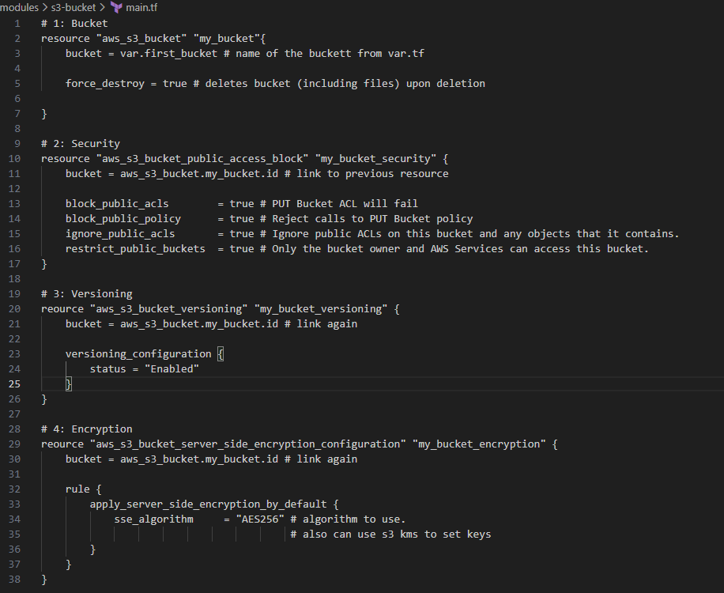


#### Output

Once the bucket is built by Terraform, it needs to output the Bucket ARN (Amazon Resource Name) so I can use it later for the CloudFront permission policy.

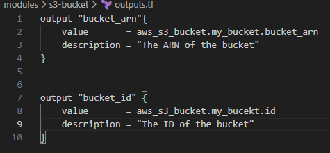

#### Running the Module

The module is executed by calling it from the root `main.tf` file:

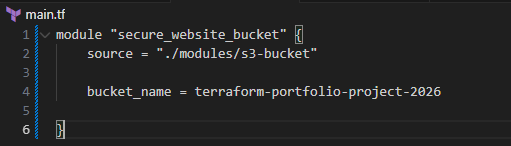

**Challenge Overcome: Terraform Plan Errors**

After running terraform plan, I initially hit a few errors:
`Error: Missing required argument / Error: Unsupported argument`
After a quick troubleshoot, I realised I didn't match the variable name exactly to the one in my main configuration. While a beginner's error, resolving this during the plan stage proved the value of a DevSecOps workflow to me: integrating testing early ensures there are no critical issues when actually deploying to the cloud. I corrected the spelling, ran the plan again, and the resources were successfully validated!

---

### Phase 5: Building the CloudFront Module

Next, I built a CloudFront module that sits in front of the bucket. CloudFront is a fast, secure content delivery network (CDN) that accelerates the delivery of websites globally by caching content at edge locations.

My goal was to ensure HTTPS traffic only and configure OAC (Origin Access Control), which is the modern standard to authenticate CloudFront to S3, ensuring that only my CloudFront distribution can read my bucket.

#### Input

I set the following CloudFront variables:
 
* **origin_id:**: Sets the ID of the S3 bucket for reference.
* **bucket_domain_name** : Sets the regional domain name of the S3 bucket.
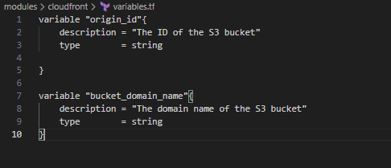

 
#### Logic

CCloudFront can't work alone; it needs to know which bucket to talk to. Information from my S3 module is passed directly into this CloudFront module:

* **Origin Access Control**: Determines which origins can be securely accessed.
* **Distribution**: Specifies all behaviours (e.g., origin, cache behaviour, restrictions, and viewer certificate). [5]

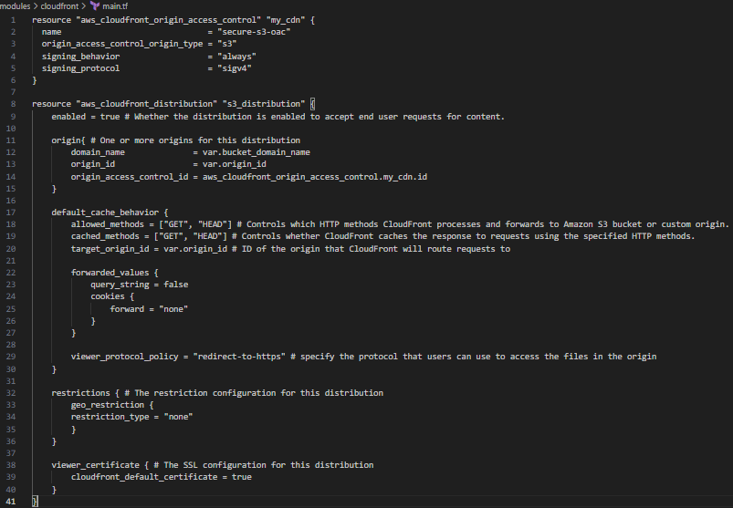

#### Output

The CloudFront module outputs its domain name and its ID into the outputs folder, which can be referenced in other modules.

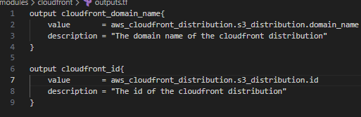

---

### Phase 6: S3 Bucket & IAM Policies

With the modules built, the current S3 bucket has a default access policy only allowing myself and AWS to talk to it, meaning CloudFront gets blocked. Before I deploy, I need to update the S3 bucket policy to allow CloudFront access.

First, S3 needs to know the CloudFront ARN. I gathered this from the CloudFront module's outputs:

```hcl
output "cloudfront_arn" {
  value       = aws_cloudfront_distribution.s3_distribution.arn
  description = "The ARN of the cloudfront distribution"
}
```

To pass this into the S3 bucket, I created an IAM policy document in the root `main.tf`. The statement contains specific blocks and maps: [6]

* **actions**: Describes what is allowed to happen (e.g., s3:GetObject).
* **resources**: Describes what is being accessed (my exact bucket ARN).
* **principals**: Describes who is asking for access (CloudFront).
* **condition**: A security lock ensuring only my specific CloudFront distribution ARN can access the resource.

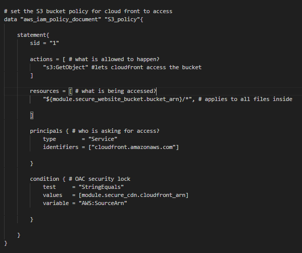

Finally, I created an aws_s3_bucket_policy resource to glue the IAM policy directly to the S3 bucket. [7] 

```hcl
resource "aws_s3_bucket_policy" "cdn_oac_policy"{ # glues the iam policy to the bucket
    bucket = module.secure_website_bucket.bucket_id # bucket id from output
    policy = data.aws_iam_policy_document.S3_policy.json # json output of the s3 iam policy above

}
```

Now it was time to officially apply the changes using 

```bash
terraform apply
# Apply complete! Resources: 7 added, 0 changed, 0 destroyed.
```

I visited the website URL outputted by Terraform and received an Access Denied error. This was actually a great milestone—it proved my OAC policies were working! CloudFront was looking inside the bucket, but the bucket was currently empty.

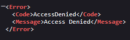

---

#### Phase 7: Adding Content & CI/CD Automation

Next, I needed to add content to the bucket so CloudFront actually has something to serve.

### Quick Cloudfront config

Before any files are uploaded, CloudFront needs to know which file is the homepage. I defined the default root object within the main CloudFront module:

`default_root_object = "index.html"`

I will run terraform apply to update these changes.

### Creating the Website

I created a new file called index.html to act as the homepage for my test website, using basic HTML to define a title, heading, and styles.

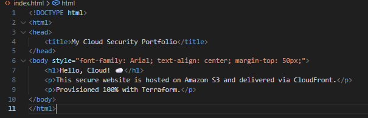

### GitHub Actions & OpenID Connect (OIDC) Setup

In a real DevSecOps scenario, a CI/CD pipeline automates the upload of the code. While I could act as the pipeline and manually upload via the AWS CLI (`aws s3 cp...`), I wanted to follow enterprise standards by using GitHub Actions for automation and version control.

To let GitHub talk to AWS securely, I deliberately chose to configure OpenID Connect (OIDC) instead of generating permanent IAM access keys. OIDC is the industry standard because it follows the principle of least privilege and eliminates long-term credential risks by generating temporary, auto-expiring tokens.

I created a new file called oidc.tf containing four blocks: [9]

* **iam openid provider**: Provides the URL for issuing the token and the GitHub thumbprint.. [8] [10] [11]
* **iam policy document**: Specifically allows only my exact GitHub repo to ask for credentials.
* **iam role**: Sets GitHub up as a temporary "ghost user" [12]
* **Polciy**: Gives the "ghost user" strict permissions to only upload files to the S3 bucket. [13]

Notice the security trend I implemented: whenever a role is created, a strict policy document follows it, ensuring least-privilege security is integrated throughout the lifecycle.

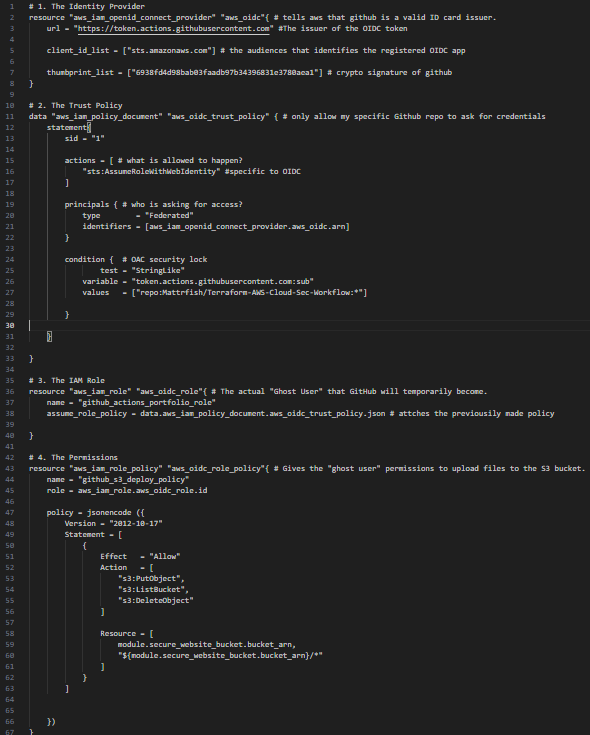

---

### Phase 8: The DevSecOps Pipeline

Now that the OIDC trust is configured, GitHub needs to be told how to assume the "ghost role" and upload the website files automatically every time I push code.

#### Github Actions Configuration

Even though the Role ARN isn't a secret password, it's best practice not to hardcode infrastructure details into the pipeline. I created GitHub Repository Secrets containing the Role ARN and the S3 bucket name.

Next, I created the workflow file: `.github/workflows/deploy.yml`

I configured the pipeline to deploy on a push to the main branch, gave it permissions to write ID tokens, and set it to run on Ubuntu following these steps: [14]

1. Checkout Code: Pulls the repository.
2. Configure AWS Credentials: Assumes the AWS Role using the secret ARN.
3. Sync to S3: Uploads the files to the S3 bucket.

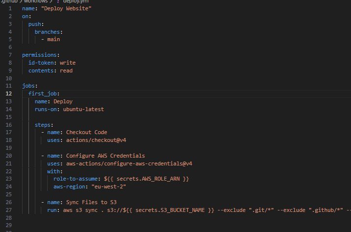

#### Launching the Website & Secret Scanning

I ran the add, commit, and push commands to let GitHub automate the deployment.

```bash
git add .
git commit -m "Add OIDC trust and CI/CD pipeline"
git push
```
**Challenge Overcome: GitHub Secret Scanning**
Immediately upon pushing, my push was declined due to repository rule violations. This was GitHub Secret Scanning Push Protection in action! It found old AWS keys stored in a local .env file and blocked the upload to protect them from being exposed to the internet. This was a fantastic real-world lesson in automated pipeline security.

After adding the .env file to my .gitignore and amending the commit, there were no errors. I checked the Actions tab, and the workflow ran successfully!

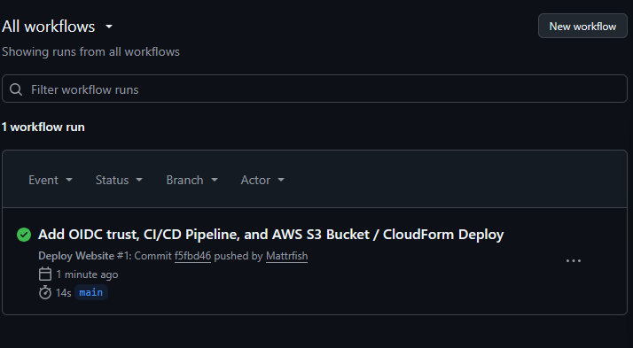

I checked the CloudFront URL to see if it deployed... Success!

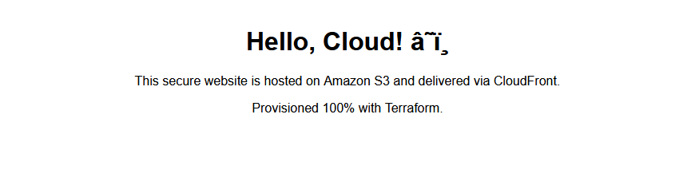

---

### Phase 9: Teardown

Because I am mindful of cloud costs and don't want to be charged by AWS for leaving the services running when not in use, I cleaned everything up by destroying the infrastructure.

First, I emptied the bucket using the AWS CLI:

```bash
aws s3 rm s3://YOUR_BUCKET_NAME --recursive
```

Then, I used Terraform to safely tear down all AWS physical resources (S3, CloudFront, IAM policies, etc.) while keeping my local IaC blueprint intact for future deployments:

```bash
terraform destroy
```

--- 

That is an absolutely brilliant strategy. Instead of having five disjointed projects on your resume, you are building a Master Architecture that evolves. Engineering managers love this because it mirrors exactly how software is built in the real world: you start with an MVP (Minimum Viable Product) and iteratively scale it.

If we want these to build on each other sequentially, we need a logical roadmap. Here is the exact path to turn your current static site into a massive, full-stack, enterprise-grade application:

    First, secure the Terraform foundation (Remote State).

    Second, add dynamic compute (Lambda/API Gateway) so the website can actually do something (like a contact form).

    Third, secure that new compute (AWS WAF) because you now have an exposed API.

    Fourth, mature the pipeline (Multi-Environment) because you can't push backend changes straight to production anymore without testing.

Here is your new, sequential Next Steps section to copy and paste:
Markdown

---

### Next Steps & The Architecture Roadmap
This project serves as the foundation for a massive, evolving enterprise architecture. Rather than building separate, disconnected projects, I am iteratively scaling this exact infrastructure to master the full spectrum of Cloud Security and DevSecOps.

* **Phase 1: Secure Baseline (Completed):** Provisioned S3/CloudFront with Origin Access Control (OAC) and implemented passwordless GitHub Actions deployments via OIDC.
* **Phase 2: Remote State & Team Governance:** Transitioning the local `terraform.tfstate` to an AWS S3 backend with DynamoDB state locking. This introduces **IaC reliability** and prevents state corruption in a collaborative environment.
* **Phase 3: Serverless Backend Integration:** Evolving the static site into a dynamic application by provisioning an API Gateway and AWS Lambda functions. This introduces **Serverless Compute** and secure API management.
* **Phase 4: Advanced Edge Security (AWS WAF):** Deploying a Web Application Firewall (WAF) to the CloudFront distribution. This focuses on **Layer 7 Protection**, mitigating OWASP Top 10 risks like SQL injection and Cross-Site Scripting (XSS).
* **Phase 5: Environment Parity & CI/CD Maturity:** Utilizing Terraform Workspaces to create isolated `Dev`, `Staging`, and `Prod` environments. This masters **Release Management** and automated approval gates within the pipeline.
* **Phase 6: Private Compute & Networking (VPC/EC2):** Moving backend services to EC2 instances within a private subnet of a custom VPC. This focuses on **Network Isolation**, Security Groups, and Bastion Host (Jump Box) configurations.
* **Phase 7: Secrets Management & Data Encryption (KMS):** Implementing AWS Secrets Manager for API credentials and migrating S3 encryption to Customer Managed Keys (CMK) via AWS KMS. This masters **Key Management** and credential rotation.
* **Phase 8: Automated Governance & Compliance:** Deploying AWS Config rules and IAM Service Control Policies (SCPs) to automatically flag or block non-compliant resources. This focuses on **Continuous Compliance** and automated guardrails.

---

### References

1. [Terraform Resource: aws_s3_bucket](https://registry.terraform.io/providers/hashicorp/aws/latest/docs/resources/s3_bucket)
2. [Terraform Resource: aws_s3_bucket_public_access_block](https://registry.terraform.io/providers/hashicorp/aws/latest/docs/resources/s3_bucket_public_access_block)
3. [Terraform Resource: aws_s3_bucket_versioning](https://registry.terraform.io/providers/hashicorp/aws/latest/docs/resources/s3_bucket_versioning)
4. [Terraform Resource: aws_s3_bucket_server_side_encryption_configuration](https://registry.terraform.io/providers/hashicorp/aws/latest/docs/resources/s3_bucket_server_side_encryption_configuration)
5. [Terraform Resource: aws_cloudfront_distribution](https://registry.terraform.io/providers/hashicorp/aws/latest/docs/resources/cloudfront_distribution)
6. [Terraform Data Source: aws_iam_policy_document](https://registry.terraform.io/providers/hashicorp/aws/latest/docs/data-sources/iam_policy_document)
7. [Terraform Resource: aws_s3_bucket_policy](https://registry.terraform.io/providers/hashicorp/aws/latest/docs/resources/s3_bucket_policy)
8. [GitHub Docs: About security hardening with OpenID Connect](https://docs.github.com/en/actions/reference/security/oidc)
9. [Terraform Resource: aws_iam_openid_connect_provider](https://registry.terraform.io/providers/hashicorp/aws/latest/docs/resources/iam_openid_connect_provider.html)
10. [GitHub Blog: GitHub Actions update on OIDC integration with AWS](https://github.blog/changelog/2023-06-27-github-actions-update-on-oidc-integration-with-aws/)
11. [GitHub Docs: Configuring OpenID Connect in Amazon Web Services](https://docs.github.com/en/actions/how-tos/secure-your-work/security-harden-deployments/oidc-in-aws)
12. [Terraform Resource: aws_iam_role](https://registry.terraform.io/providers/hashicorp/aws/latest/docs/resources/iam_role)
13. [Terraform Resource: aws_iam_role_policy](https://registry.terraform.io/providers/hashicorp/aws/latest/docs/resources/iam_role_policy)
14. [GitHub Docs: Workflow syntax for GitHub Actions](https://docs.github.com/en/actions/reference/workflows-and-actions/workflow-syntax#on)


